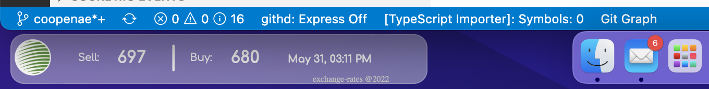

# Exchange rates widget for Übersicht

This widget allows you to show the exchange rates for different banks.

#### Banks added

BCR, BCT, Coopenae

#### Banks can be added

Any bank with public api rest to get the exchange

## Screenshots





## Install the widget

- install http://tracesof.net/uebersicht/
- Download the widget and copy in the Übersicht widgets folder

## Configuration

Open the file named `bankTransformation.js` and select in the field `show` the bank exchange date you want to show.

## Adding more banks

To add other banks

1. Find the `ApiRest` of the bank which returns the exchange, This should be GET and public.
2. Add a new bank transformation in the section banks in the file `bankTransformation.js` and add the `name` to identify, it should be unique, `url` which is the url of the API to extract the data , `pic` url for the icon and the transformation functions to extract the data from the response

```js
{
  show: "coopenae",
  banks: [
    {
      name: "coopenae",
      pict: "/exchange-rates.widget/assets/coopenae.png",
      url: "https://www.vista360coopenae.fi.cr/TreasuryAPI/api/ExchangeRate?operatorCode=0&countryCode=CR&channelCode=WB&currencyCode=COL&type=1",
      transformation: {
        buyRate: (data) => +data.buyRate,
        sellRate: (data) => +data.sellRate,
        date: (data) => new Date(),
      },
    },
}
```

## Übersicht

In command line for Übersicht
https://github.com/felixhageloh/uebersicht
http://tracesof.net/uebersicht/

## Stay in touch

- Author - Luis Arias 2022 <<ariassd@gmail.com>>
  [GitHub profile](https://github.com/ariassd)

## License

This software is licensed under [MIT License](LICENSE)

 

November 2020
